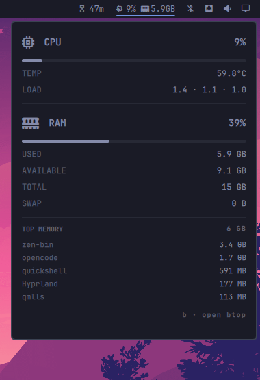

# CPU & RAM

A bar widget showing live CPU and memory usage with a click-to-open details
popup: CPU percent, temperature, and load average; RAM used / available /
total / swap; and the top memory consumers.



## Requirements

- Omarchy shell (Quickshell-based)
- A Nerd Font for the glyphs (`󰍛`, ``) — most Omarchy themes ship one

## Install

```bash
omarchy plugin add https://github.com/ax1g/quickshell-cpu-ram-usage.git
omarchy plugin enable agx.cpu-ram
```

or install by hand:

1. Clone into `~/.config/omarchy/plugins/agx.cpu-ram/`
2. `omarchy-shell shell rescanPlugins`
3. `omarchy plugin enable agx.cpu-ram`

The widget polls a bundled `agx-cpu-ram-usage` script every 5 seconds; no
external data source is needed.

## Settings

| Key        | Type   | Default | Meaning                                            |
|------------|--------|---------|----------------------------------------------------|
| `interval` | number | `5`     | Polling interval in seconds                        |
| `exec`     | string | `""`    | Custom poll command; empty uses the bundled script |

Set them with `omarchy bar set agx.cpu-ram <key> <value>`.

Right-click toggles between the full readout and a single CPU icon; the
choice is remembered in the widget's entry.
